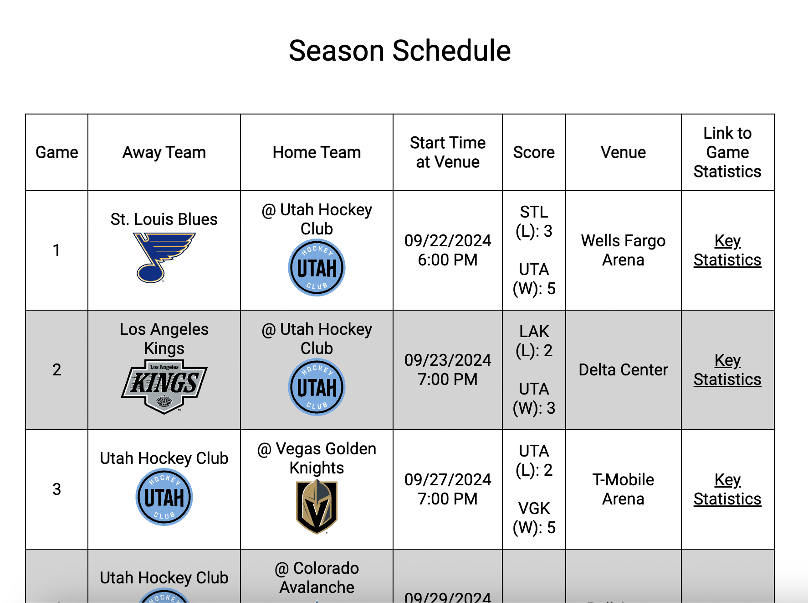

# NHL Team Info

A web application for NHL fans who want to easily see information about their favorite team(s).

## Why I Built This

For the final project of the first half of the LearningFuze coding boot camp, I wanted to build a front-end web application that would be useful to a wide variety of people. This web application will allow NHL fans to see the current, and historical, roster, schedule and related statistics for all active NHL teams.

## Live Demo

Try the application live at [https://eacorcoran.github.io/nhl-team-info/](https://eacorcoran.github.io/nhl-team-info/)

## Technologies Used

- HTML5
- CSS3
- Typescript

## Public External API Used

[https://gitlab.com/dword4/nhlapi/-/blob/master/new-api.md](https://gitlab.com/dword4/nhlapi/-/blob/master/new-api.md)

## Features

- Fans can view a list of NHL teams
- Fans can favorite an NHL team
- Fans can remove an NHL team from their "favorites"
- Fans can see the roster for an NHL team for the selected year
- Fans can see the schedule for an NHL team for the selected year
- Fans can see key statistics for any completed game on an NHL team's schedule

## Preview

